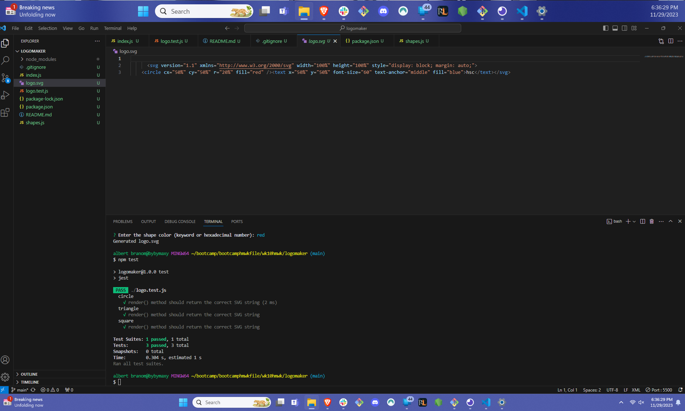
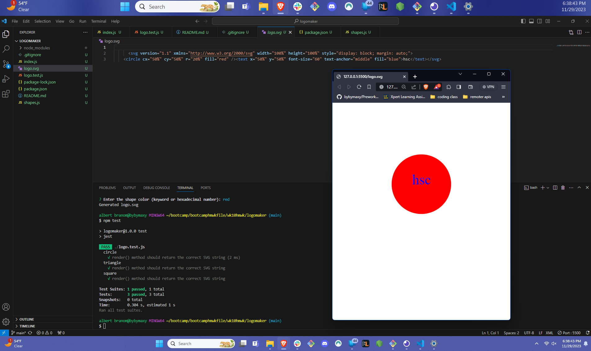
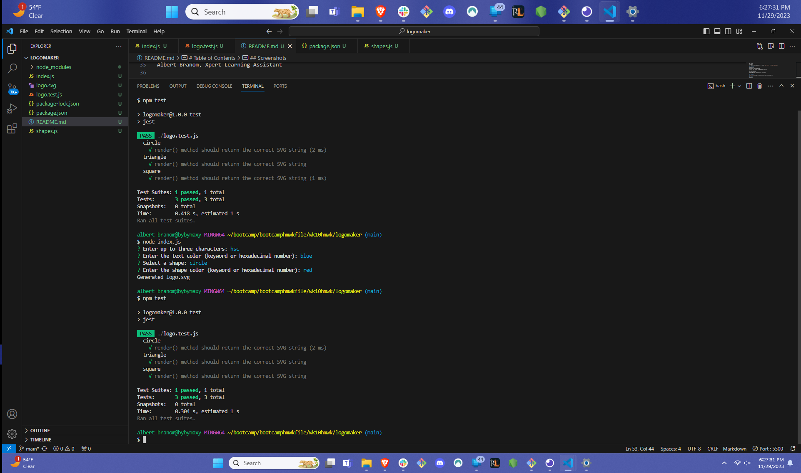

# Table of Contents
- [Project Name](#project-name)
- [Description](#description)
- [Installation](#installation)
- [Usage](#usage)
- [Features](#features)
- [Contributing](#contributing)
- [License](#license)
- [Tests](#tests)
- [Questions](#questions)
- [Screenshots](#screenshots)

## Project Name
${LogoMaker}

## Description
${description}
Automation of creating a logo.

## Installation
${installation}
Download git repository, ensure you have proper dependencies.

## Usage
${usage}
To run the logo automator, do either `npm start` or `node index.js`.

## Features
${features}
Automation of logo making 
testing that shapes being made are correct

## Contributing
${contributing}
Albert Branom, Xpert Learning Assistant

## License
[Mit License](https://choosealicense.com/licenses/mit/#)

## Tests
${tests}
tests for shapes to ensure they work

## Questions
- [bybymaxy](https://github.com/bybymaxy/LogoMaker)
- [send-email-to](mailto:bybymaxy@gmail.com)
- [recording-of-working-application](https://watch.screencastify.com/v/9OuvJHxKn60iWTK00Lzn)

## Screenshots
${screenshots}

